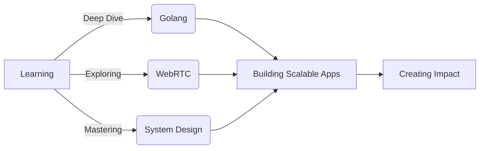

<div align="center">

# ✦ AMAN DIXIT ✦

### Full-Stack Developer • Problem Solver • Open Source Enthusiast


[](https://github.com/aman123956)
[](https://www.linkedin.com/in/aman123956)
[](https://www.amandixit.me)
[](mailto:amandixit033@gmail.com)

</div>

---

## 🎯 About Me

```typescript
const aman = {
    location: "Delhi, India",
    role: "Full-Stack Developer",
    currentFocus: ["Golang", "WebRTC", "System Design"],
    activeProjects: ["JSSCONNECT", "Drive Clone", "CrickIQ"],
    workingOn: "Building scalable web applications",
    collaborateOn: "Open source projects & innovative ideas",
    askMeAbout: ["JavaScript", "Backend Architecture", "RESTful APIs", "System Design"],
    funFact: "I debug code faster than I debug my life choices 😄"
};
```

<details>
<summary>📫 <b>Get in Touch</b></summary>

<br/>

- 💼 **Professional**: [LinkedIn](https://www.linkedin.com/in/aman123956)
- 🌐 **Portfolio**: [amandixit.me](https://www.amandixit.me)
- 📝 **Blog**: [Tech Insights](https://javascript-blogs.netlify.app)
- 📧 **Email**: amandixit033@gmail.com
- 📄 **Resume**: [View Resume](https://drive.google.com/file/d/1Gmde4DBf3yEfJ0T4PnaNihFBOrlFkFPF/view?usp=sharing)

</details>

---

## 🛠️ Tech Arsenal

<table>
<tr>
<td valign="top" width="33%">

### 🎨 Frontend


</td>
<td valign="top" width="33%">

### ⚙️ Backend


</td>
<td valign="top" width="33%">

### 🔧 Tools & DevOps


</td>
</tr>
</table>

### 💻 Languages


---

## 📊 GitHub Analytics

<div align="center">
  
  
</div>

<div align="center">
  
</div>

<div align="center">
  
</div>

---

## 🏆 Featured Projects

<div align="center">

### 🌐 JSSCONNECT
**A developer community platform connecting tech enthusiasts**

[](https://jssconnect.herokuapp.com)
[](https://github.com/aman123956/jssconnect)

Built with `Node.js` • `Express` • `MongoDB` • `React` • `Redux`

Features forums, resources, networking capabilities, and real-time discussions

---

### ☁️ DRIVE CLONE
**Cloud storage solution with intuitive file management**

[](https://drive-strike.netlify.app)
[](https://github.com/aman123956/drive-clone)

Built with `React` • `Firebase` • `Material-UI`

File sharing, folder organization, and seamless cloud storage experience

</div>

---

## 🎯 Competitive Programming

<div align="center">

[](https://codeforces.com/profile/aman123956)
[](https://www.leetcode.com/aman123956)

</div>

---

## 🎨 Current Focus



---

## 💭 Philosophy

<div align="center">

> *"Code is like humor. When you have to explain it, it's bad."* – Cory House

### Let's build something extraordinary together! 🚀

</div>

---

<div align="center">

### 🌟 Show some love by starring my repositories! 🌟


**Made with ❤️ by Aman Dixit**

</div>
